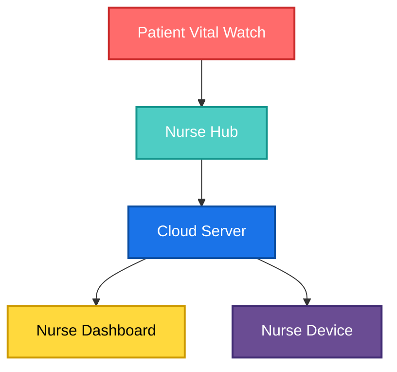

# Vital Watch - Repository

Hardware details for the Vital environment - Block diagrams , architecture , flow ,  Schematics , Layouts , 3D files , testing results (proofs of the concepts)

--------Team : **INNOVATORS**----------

Kalidindi Akash Varma         -     TEAM LEAD

Madabattula Surya Teja        -     HARDWARE DESIGNER

Thirakala Pranav Sai          -     R&D 

Kaknnajyosula Harsha Vardhan  -     TESTING ENGINEER

Contact: tejasurya67049@gmail.com

# Vital Watch — VibeAithon Project  

## 📖 Overview  

**Vital Watch** is a medical-oriented smart wearable developed during **VibeAithon**. Unlike regular smartwatches, this device is focused on **patient health monitoring in hospitals or elder care facilities**.  

The watch continuously monitors critical health parameters like:  
- 🫁 Oxygen (SpO₂) levels  
- 🩸 Blood pressure  
- ⚡ ECG signals  
- 🧍 Fall detection  
- ❤️ Heart rate  

Using **ESP-NOW protocol**, Vital Watch enables **low-power, Wi-Fi-independent communication** between patients’ watches (slaves) and caretaker/nurse watches (masters). It also supports **hybrid communication** — automatically switching to Wi-Fi for long-range alerts when out of ESP-NOW range.  

---

## 🚑 Real-Life Use Case  

Imagine a hospital with **10 patients assigned to one nurse**. Monitoring all patients constantly is almost impossible, and delays can be fatal in cases of:  
- Sudden **low BP**  
- **Low oxygen levels**  
- Unexpected **falls or faints**  

With **Vital Watch**:  
- Each patient is given a **slave watch**.  
- The nurse is given a **master watch**.  
- If a patient’s vitals drop or they faint, the nurse’s watch instantly receives an **alert**.  
- Nurse can take immediate action, **reducing risk of sudden deaths**.  

Thanks to **ESP-NOW**, the system does not need Wi-Fi or Bluetooth, ensuring faster, lightweight communication.  
When outside ESP-NOW’s range, it **seamlessly switches to Wi-Fi** for cloud-based alerts, then reverts back to ESP-NOW when in range again.  

---

## ✨ Features  

- **Vital Monitoring**: Continuous tracking of SpO₂, blood pressure, heart rate, ECG.  
- **Fall Detection**: Alerts caretaker in case of sudden patient collapse.  
- **ESP-NOW Communication**: Low-latency, Wi-Fi-free protocol for local alerts.  
- **Wi-Fi Integration**: Cloud-based alerts when outside ESP-NOW range.  
- **Multi-Device Support**: Multiple patient watches (slaves) can be paired with a single nurse watch (master).  
- **Fail-Safe Alerts**: Nurse receives notifications instantly on critical events.  

---

## 🏗️ System Architecture  

---

## 📂 Repository Structure 

## Repository Overview
| Directory | Description |
|------------|-------------|
| About | Overview of the project and its goals |
| Architecture Flow chart | System and workflow diagrams |
| Block Diagrams | Hardware and signal path representations |
| schematics | Detailed electrical connections |
| layouts | PCB routing and placement |
| 3D files | 3D visualization and enclosure support |
| UI_Dashboard | Application and interface design |
| Security | AES encryption and data safety mechanisms |
| Latency | Communication speed tests |
| Hybrid Switching | Online-offline automatic mode switching |
| Bill Of Materials | Components list and sourcing |
| images | Visual documentation |
| Hardware Overview | Details of the Hardware |
| Vital Watch - PCB | Schematics and Layouts of Vital_watch |
| Mechanical enclosure | Outer Shell of Vital_watch |
| Final Project | Actual prototype results |

**Note: The actual project required for round 3 submission is displayed in the final project and mechanical enclosure directories**
